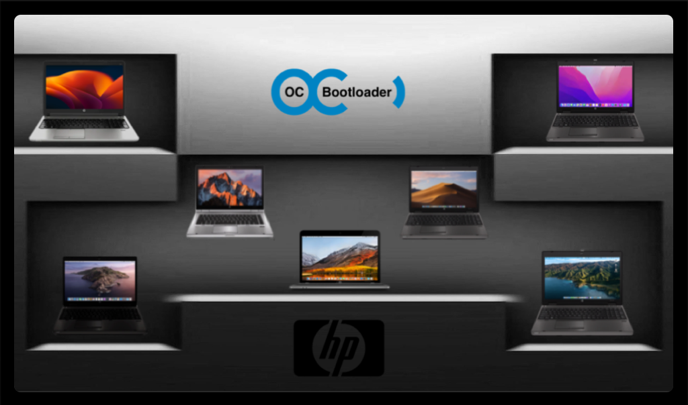

HP-Probook-EliteBook-Package-Creator-OC

  

Thanks to ➤ [Support Project](https://github.com/chris1111/HP-Probook-EliteBook-Package-Creator-OC/blob/master/Support-HP-Probook-EliteBook-Package-Creator-OC-Project.md)

### Latest Update 28 Sept 2023 Fix Broadcom Wifi Sonoma 14.1

- All infos about ➦ [HP-Probook-EliteBook-Package-Creator-OC for macOS Sonoma](https://github.com/chris1111/HP-Probook-EliteBook-Package-Creator-OC/blob/master/macOS%20Sonoma%20Support.md) 

- All Video and infos about ➦ [HP-Probook-EliteBook-Package-Creator-OC for macOS Ventura](https://github.com/chris1111/HP-Probook-EliteBook-Package-Creator-OC/blob/master/macOS%20Ventura%20Support.md) 
 
- All Video and infos about ➦ [HP-Probook-EliteBook-Package-Creator-OC for macOS Monterey, macOS Big Sur](https://github.com/chris1111/HP-Probook-EliteBook-Package-Creator-OC/blob/master/Utilisation%20Video.md)

View ➤ [List Update](https://github.com/chris1111/HP-Probook-EliteBook-Package-Creator-OC/blob/master/List%20Update.md)

#### Download Latest Release Update 11 April 2023 (V-3): ➤ [HP-Probook-EliteBook-Package-Creator-OC ](https://github.com/chris1111/HP-Probook-EliteBook-Package-Creator-OC/releases/tag/V-3)
- Included support Monterey 12, Ventura 13, Sonoma 14

----------------------------------------------------------------------------

#### Download Release Update 24 March 2023 (V-2): ➤ [HP-Probook-EliteBook-Package-Creator-OC ](https://github.com/chris1111/HP-Probook-EliteBook-Package-Creator-OC/releases/tag/V-2)
- Included support Monterey 12

#### Any issue without the Log or all relevant information will be deleted. 
- This does not work on a VM

#### For Clover with Big Sur 11 and Monterey 12 ➣ [HP-Probook-EliteBook-Package-Creator-Clover](https://github.com/chris1111/HP-ProbookEliteBook-Package-Creator-Clover)

## Credit: 
- Tester: asdesoso, RegieMac, Axon, jeremy 94, djams, Paul, sajtos888
- Old Project Tester: Screenz, mus68, MueKo, 
platinumsteel, doodoo94, jeremy19, arno608rw, Mtkhan13
- RehabMan for all DSDT patch, patchmatic
- kexts inside OpenCore Credit: rehabman, vit9696, Mieze, lvs1974, FireWolf
- Intel for IASL
- Apple for Pkgbuild
- [OpenCore team for OpenCore](https://github.com/acidanthera/OpenCorePkg)
- HD 4000 Monterey 12 [Base on Jacklude](https://github.com/jacklukem) work
- HD 4000 Monterey 12 [educovas](https://github.com/educovas) EduCovas for fixed google fonts
- HD 4000 Monterey 12 [Dhinak](https://github.com/DhinakG) for found using beta 6 Metal binaries
- HD 4000 Monterey 12 [khronokernel](https://github.com/khronokernel) for fixing google fonts (WebKit)
- HD 4000, HD 4600 Sonoma 14 Ventura 13 [Moraea](https://github.com/moraea/non-metal-frameworks), [OCLP](https://github.com/dortania/OpenCore-Legacy-Patcher/) for Support Sonoma 14 Ventura 13 

- [Packager chris1111](https://github.com/chris1111)

----------------------------------------------------------------------------
* What you need

   - Disable the security SIP and Gatekeeper on your Mac
   - Blank USB key 16 gig for Install macOS
   - Install macOS xxx.app (From Mac App Store)
   
### Bios Version 7 series:
- Known working bios version is F61, F62, F64 F66 [(F73 ➤ Confirmed 2570p)](https://www.insanelymac.com/forum/topic/344428-pre-release-macos-big-sur/?page=91&tab=comments#comment-2734611) [(F74 ➤ Confirmed 8470p)](https://github.com/chris1111/HP-Probook-EliteBook-Package-Creator-OC/commit/e6eb41e137c220f3f08b4a8776a8f2516a59e133)
Important Try do not take another Bios version! it would not be dramatic but it's the known bios that works very well

### Bios Version 8 series:
- Bios : Recommend  1.48

### Bios setup: To start, set BIOS to defaults.
- Disable LAN/WLAN Switching
- UEFI Hybrid with CSM
- Disable FastBoot
- IGPU graphics memory set to 64mb for 8 series if available on Device Configurations
----------------------------------------------------------------------------

### To use this program you will have to boot on a fresh installation with the 
- Create Install Media HP Laptop tools « IMPORTANT » without adding file aml (DSDT.aml), (SSDT.aml) in  /EFI / OC / ACPI. Only with the two files that are present SSDT-IGPU.aml, SSDT-HMF.aml.

- This program only uses OC and kexts injection, there is no kext to modify in the system and no kext will install in macOS system.
### Support Laptop

- 8 series laptop: 
HP Probook 3x0 G1, Probook 4x0 G1/G2, Probook 6x0 G1, Elitebook 8x0 G1, ZBook G1, Folio 1040 G1
———————————————————————————————

- 7 series laptop: HP Probook EliteBook * Ivy Bridge * ](https://ark.intel.com/content/www/us/en/ark/products/codename/29902/ivy-bridge.html#@Mobile) . Support macOS Sierra 10.12 to macOS Monterey 12
- HP Probook 4x40s, 4x0 G0, 6x70b, 6x70B-AMD, 6x70B-NVIDIA,  Elitebook 8x70p, 2x70p, 9x70m

- ———————————————————————————————
### DSDT PATCH:
- Integrality of the complete system for 7/8 series
7 series:
- Intel HD 4000 Patch (Low screen, High Screen)
- HDMI Patch, (Low screen, High Screen)
- Fan Patch
8 series:
- Patch Intel HD 4600/4400 (High Screen 1080p)
- Patch HDMI, (High Screen 1080p)
- Fan Patch
- ———————————————————————————————

## Recommand WIFI
- Wifi mini PCI [AzureWave WLAN+BT BCM94352HMB](https://www.ebay.fr/itm/Azurewave-AW-CE123H-Broadcom-BCM94352-802-11ac-WiFi-card-Bluetooth-4-0-for-MAC-/272248789669) ebay
- Wifi mini PCI [AzureWave WLAN+BT BCM94352HMB](https://www.aliexpress.com/item/1005004003208737.html?spm=a2g0o.productlist.main.5.ba424b56jpJt9v&algo_pvid=fe5d8a47-4fce-4b32-95e9-6a8beb817770&algo_exp_id=fe5d8a47-4fce-4b32-95e9-6a8beb817770-2&pdp_npi=4%40dis%21CAD%2131.07%2120.5%21%21%21163.52%21%21%402103250d16918518022841640efac1%2112000027707421754%21sea%21CA%210%21A&curPageLogUid=NjZahgAxmM0P) aliexpress
- Wifi mini PCI (Native) [Azurewave BCM94360HMB](https://www.aliexpress.com/item/32860779782.html?gatewayAdapt=Msite2Pc) ➤ [You need 3 x IPEX MHF4 IPEX Gen4 UFL to IPEX-1 Connector Jack Male Pin For BCM94360HMB](https://www.ebay.ca/itm/262716190873) ➤ [also needed for center cable  Mini Pcie Wifi Internal Antenna Universal Laptop Wifi Bluetooth](https://www.aliexpress.com/item/4000478543477.html?pdp_npi=2%40dis%21CAD%21C%244.83%21C%243.43%21%21%21%21%21%402101c5b216916131891916383ee69e%2112000028175186553%21btf&_t=pvid:e8c09303-f9d5-4a82-85e1-aa93566ed773&spm=a2g0o.ppclist.product.mainProduct) 
- Wifi mini PCI [Broadcom BCM943224HMS](https://www.ebay.com/itm/253022938877?hash=item3ae957a6fd:g:8JYAAMXQVT9TFoF4) ebay
- (Broadcom BCM943224HMS working for Monterey 12.1+) with boot args `brcmfx-delay=15000`

----------------------------------------------------------------------------

## Card reader Fix 7 series for macOS Big Sur 11 and Higher only.
- Bios setup ☞ Port Option: Uncheck 1394 Port
- SIP security disable

- Reboot to the SSD then Install [JMicron-Card-Reader installer](https://github.com/chris1111/JMicron-Card-Reader) Folowed Guide.pdf
- Before reboot, you have to allow JMicron update extensions
#### View Spoiler ⇩ Card Reader works

 

View list  

   
	

----------------------------------------------------------------------------

#### 7 series High Screen (1600x900) Fix Boot USB Installer black screen ➡︎ [Fix Boot USB Installer (1600x900) black screen](https://github.com/chris1111/HP-Probook-EliteBook-Package-Creator-OC/issues/2#issuecomment-679373248)

----------------------------------------------------------------------------

### Package Creator

### USB Installer

- OpenCore Bootloader

- Troubleshooting ➤ [High Screen Laptop 1600x900](https://github.com/chris1111/HP-Probook-EliteBook-Package-Creator-OC/issues/2#issuecomment-679373248)

## macOS Installation Steps
- 1- Boot on Install macOS ➦ (Wait for the last line of verbose mode, `don't worries about ACPI error` and your screen will open) Install macOS
- 2- Boot on macOS Installer (25 minutes Install time)
- 3- Boot on macOS Installer (Wait 5 + minutes for the last line of verbose mode (Forcing CS_RUNTIME)  and the system will reboot)
- 4- Reboot again on the SSD ➦ (Wait for the last line of verbose mode and your screen will open)
----------------------------------------------------------------------------

### Post Installer- ⬇︎ Readme first:

#### Build Project Xcode: ➤ [Wiki Page](https://github.com/chris1111/HP-Probook-EliteBook-Package-Creator-OC/wiki/Build-Project)

#### Visite Site: ➤ [Site Page](https://chris1111.github.io/HP-Probook-EliteBook-Package-Creator-OC/)
